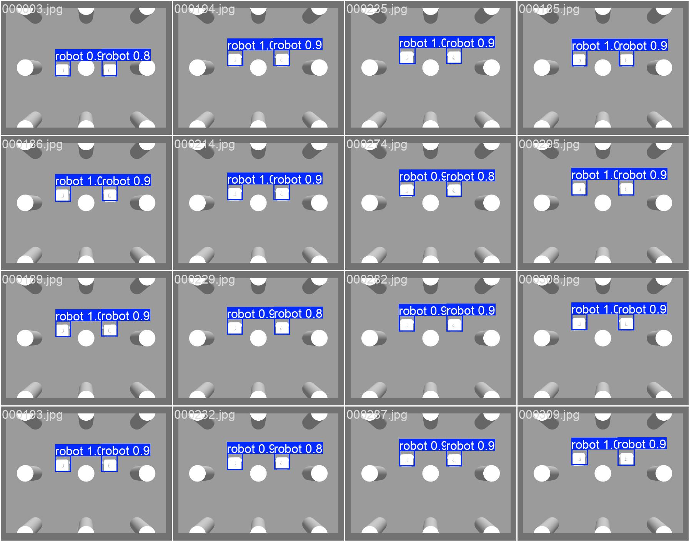
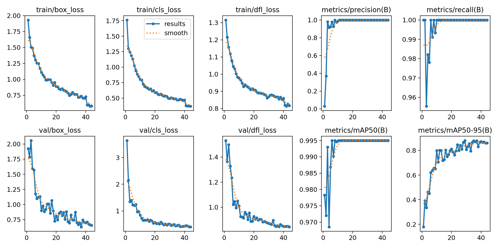
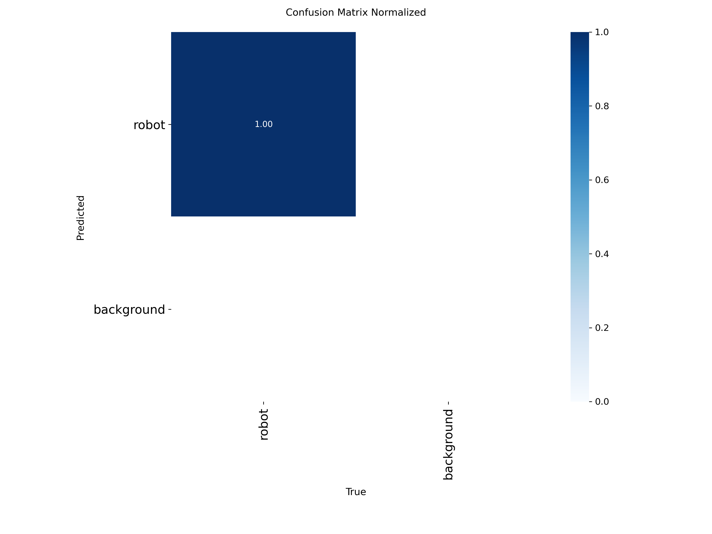
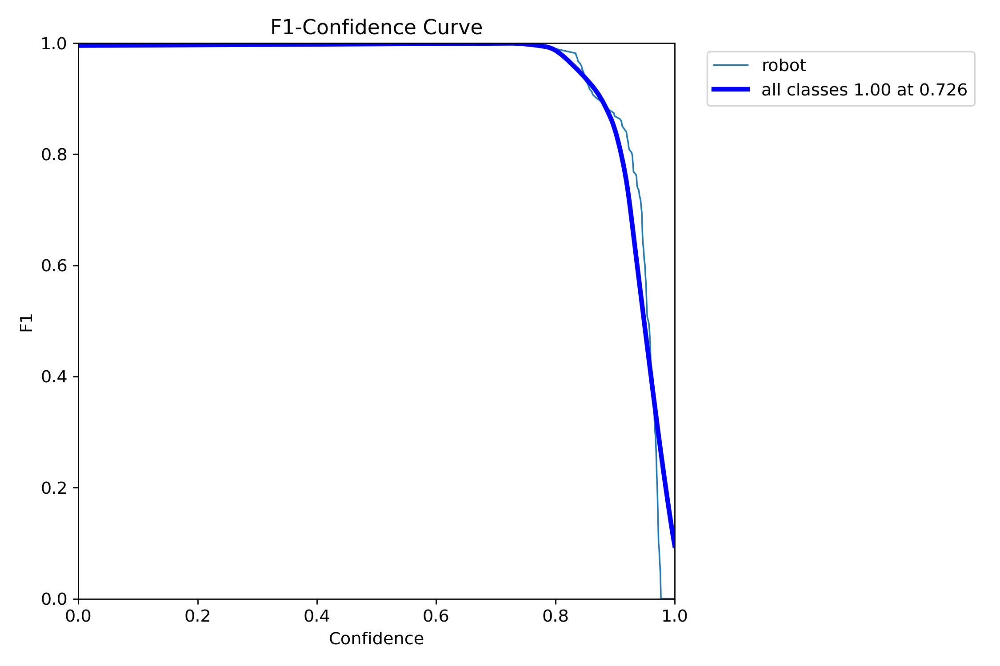

# CERISE Multi-Robot Nav2 + YOLO Dataset

**Gêmeo Digital para Cenário Multi-Robô via Detecção YOLO**

Simula 2 TurtleBot3 Waffle com navegação autônoma (Nav2), coleta dataset de imagens com anotações de posição e treina YOLO v8 para estimar posição dos robôs somente pela imagem da câmera.

> **Trabalho de fusão sensorial (EKF)**: este repositório também contém um
> segundo trabalho, independente deste README — um Extended Kalman Filter
> fundindo detecção YOLO e odometria para localização multi-robô (paper
> LAFusion 2026). Código em `src/cerise_nav/cerise_nav/ekf_fusion_node.py`
> e `scripts/eval_ekf_vs_baseline.py`/`eval_ekf_continuous_error.py`,
> documentação consolidada em [`docs/lafusion/README.md`](docs/lafusion/README.md),
> pacote de reprodutibilidade em [`bags/reproducibility_package/README.md`](bags/reproducibility_package/README.md).

## Objetivo (Prof. Alisson)

1. ✅ Simular 2 TurtleBot3 Waffle com navegação autônoma Nav2
2. ✅ Câmera overhead capturando posições dos robôs com projeção correta
3. ✅ Pipeline de coleta de dataset com anotações YOLO
4. ⏳ Treinar YOLO v8 com dataset real e validar inferência end-to-end

## Status

| Fase | Descrição | Status |
|------|-----------|--------|
| 1 | Simulação 2-robot + Nav2 | ✅ Funcional |
| 2 | Câmera overhead + projeção world→pixel | ✅ Implementado |
| 3 | Dataset collector + anotações YOLO | ✅ Implementado |
| 4 | Treino YOLO + validação gêmeo digital | ⏳ Requer dataset real |

## Stack

| Componente | Versão |
|-----------|--------|
| OS | Ubuntu 22.04 (WSL2 ou nativo) |
| ROS2 | Humble |
| Gazebo | Classic 11.10.2 |
| Nav2 | Humble |
| YOLO | Ultralytics v8 |

## Quick Start (WSL2)

### 1. Instalar dependências e build

```bash
sudo apt install ros-humble-nav2-bringup ros-humble-turtlebot3-gazebo
pip install ultralytics opencv-python numpy

git clone https://github.com/santtyan/cerise-turtlebot3-nav.git
cd cerise-turtlebot3-nav
source /opt/ros/humble/setup.bash
colcon build --symlink-install
source install/setup.bash
```

### 2. Rodar simulação com câmera + Nav2

```bash
# Terminal 1 — Gazebo + 2 robots + Nav2 + initial poses (automático, ~60s)
./launch_2robots_with_camera.sh
# Aguarda "[OK] Nav2 pronto!" antes de abrir outros terminais

# Terminal 2 — Goals aleatórios (robôs navegam autonomamente)
source /opt/ros/humble/setup.bash
python3 scripts/random_nav_goals.py

# Terminal 3 — Coletar dataset (~10 min)
source /opt/ros/humble/setup.bash
source install/local_setup.bash
ros2 run cerise_nav dataset_collector

# Terminal 4 — Gazebo GUI (opcional, só quando pipeline estável)
gzclient
```

O `launch_2robots_with_camera.sh` já publica as initial poses automaticamente — **não** é necessário rodar `set_initialposes.sh` separadamente.

O collector salva automaticamente em `dataset/raw/images/` e `dataset/raw/annotations/` a 1 fps.

### 3. Testar pipeline sem simulação

```bash
PYTHONPATH=src/cerise_nav python test_e2e_dataset_collector.py
```

Gera 60 frames sintéticos com trajetórias circulares, valida projeção (simple + with_camera) e formato YOLO.

### 4. Split train/val e treino

```bash
# Separa dataset/raw/ em dataset/images/{train,val} + dataset/labels/{train,val}
python scripts/split_dataset.py --ratio 0.8

# Treina YOLOv8
yolo detect train data=dataset.yaml model=yolov8n.pt epochs=100 imgsz=640
```

### 5. Validar inferência

```bash
yolo detect predict model=runs/detect/train/weights/best.pt source=dataset/images/val/
```

## Arquitetura

```
gzserver (Gazebo)
  ├─ /robot1/odom, scan, amcl_pose
  ├─ /robot2/odom, scan, amcl_pose
  └─ /camera/image_raw, camera_info   ← câmera overhead z=3m FOV=60°

Nav2 (robot1 + robot2 namespaces)
  └─ NavigateToPose → trajetórias autônomas

dataset_collector (ROS2 node)
  ├─ Subscreve: image_raw + camera_info + amcl_pose
  ├─ Projeta poses world→pixel (pinhole com intrínsecos reais)
  └─ Salva: dataset/images/ + dataset/annotations/ (formato YOLO)

YOLO v8 (treinamento offline)
  └─ best.pt → inferência: câmera → posição estimada dos robôs
```

## Projeção World → Pixel

A câmera está em `z=3m` com FOV horizontal de 60° (1.047 rad), o que cobre ~**3.46m** ao redor do centro. A projeção usa os intrínsecos reais do sensor (`/camera/camera_info`) via modelo pinhole:

```python
u = fx * (world_x / camera_height) + cx_principal
v = fy * (-world_y / camera_height) + cy_principal  # Y invertido
```

O bounding box é calculado dinamicamente com base no raio real do robô (0.17m) e na altura da câmera, garantindo anotações precisas independente da posição.

## Estrutura do Projeto

```
cerise-turtlebot3-nav/
├── src/cerise_nav/cerise_nav/
│   ├── dataset_collector.py   # Node ROS2: coleta imagens + anotações
│   ├── projection.py          # Projeção world→pixel (pinhole + fallback)
│   ├── demand_generator.py    # Gerador de missões de navegação
│   └── task_allocator.py      # Alocador de tarefas multi-robô
├── world_with_camera.model    # Mundo Gazebo com câmera overhead (ATENÇÃO: causa segfault — ver Erros Comuns)
├── world_simple.model         # Mundo estável para visualização GUI (sem plugin câmera)
├── waffle_nodepth.model       # TurtleBot3 sem câmera de profundidade (WSL2)
├── launch_2robots.sh          # Headless — sem câmera
├── launch_2robots_with_camera.sh  # Headless + câmera overhead
├── run_gui.sh                 # Interface gráfica Gazebo
├── set_initialposes.sh        # Inicializa poses AMCL
├── test_e2e_dataset_collector.py  # Teste sintético do pipeline
└── dataset.yaml               # Configuração YOLO (train/val split)
```

## Visualização Gazebo (Linux Nativo)

Para visualizar com GUI no Linux nativo (com mapa + robôs visíveis):

```bash
export GAZEBO_MODEL_PATH=/opt/ros/humble/share/turtlebot3_gazebo/models:$GAZEBO_MODEL_PATH
gzserver --verbose -s libgazebo_ros_init.so -s libgazebo_ros_factory.so -e ode ./world_simple.model &
sleep 20
ros2 run gazebo_ros spawn_entity.py -entity robot1 -file ./waffle_nodepth.model -robot_namespace robot1 -x 0.0 -y 0.5 -z 0.01 &
ros2 run gazebo_ros spawn_entity.py -entity robot2 -file ./waffle_nodepth.model -robot_namespace robot2 -x 0.0 -y -0.5 -z 0.01 &
sleep 10
export DISPLAY=:0
gzclient &
```

## Lições Aprendidas (Multi-Robot Nav2)

### TF Multi-Robot: cadeia obrigatória

Para Nav2 aceitar goals, a cadeia TF dentro de `/robot1/tf` deve ser completa:
```
map → odom → base_footprint → base_link
```
- `odom → base_footprint`: publicado pelo diff_drive plugin do Gazebo
- `base_footprint → base_link`: publicado pelo robot_state_publisher
- `map → odom`: publicado pelo AMCL **somente após receber initial_pose**

### AMCL não publica map→odom sem initial_pose

O AMCL fica aguardando indefinidamente sem publicar `map→odom` até receber uma mensagem em `/robot1/initialpose`. Goals são rejeitados até essa mensagem chegar.

```bash
ros2 topic pub --once /robot1/initialpose geometry_msgs/PoseWithCovarianceStamped \
  "{header: {frame_id: 'map'}, pose: {pose: {position: {x: 0.0, y: 0.5, z: 0.0}, orientation: {w: 1.0}}}}"
```

O `launch_2robots_with_camera.sh` já faz isso automaticamente após 45s.

### Câmera overhead: pitch correto

- `pitch=0` → câmera aponta para frente (+x) ❌
- `pitch=1.5708` → câmera aponta para baixo (-z) ✅

```xml
<pose>0 0 3 0 1.5708 0</pose>
```

### Modelo do robô para spawn

Usar **sempre** `/opt/ros/humble/share/nav2_bringup/worlds/waffle.model` para spawn. O `waffle_nodepth.model` tem bug no plugin LiDAR (`libgazebo_ros_ray_sensor`) que causa publisher_count=0 no `/robot1/scan`, impedindo AMCL de localizar.

### Nav2 com namespace: remapping TF

RSP com namespace `robot1` deve remapear `/tf` e `/tf_static`:
```bash
ros2 run robot_state_publisher robot_state_publisher \
  --ros-args -r __ns:=/robot1 -r /tf:=tf -r /tf_static:=tf_static \
  -p robot_description:="$(cat $URDF)" -p use_sim_time:=true
```

### Goals aleatórios Nav2

`scripts/random_nav_goals.py` envia goals via `NavigateToPose` action para ambos os robôs em loop. Waypoints definidos dentro do labirinto `turtlebot3_world`.

### Projeção world→pixel: mapeamento de eixos com pitch=π/2

Com a câmera em `<pose>0 0 3 0 1.5708 0</pose>` (pitch=π/2), a rotação R_y(π/2) transforma os eixos assim:

- `X_cam = +Y_world` → `cam_x = world_y`
- `Y_cam = -X_world` → `cam_y = -world_x`
- `Z_cam = camera_height` (profundidade)

```python
# projection.py — correto para pitch=π/2
cam_x = world_y
cam_y = -world_x
cam_z = camera_height
u = fx * (cam_x / cam_z) + cx
v = fy * (cam_y / cam_z) + cy
```

**Erro comum:** usar `cam_x = world_x` e `cam_y = -world_y` (mapeamento sem rotação). Os bboxes aparecem espelhados horizontalmente em relação aos robôs reais.

### Dataset: invalidação por bug de projeção

Se o `projection.py` estava errado durante a coleta, **todo o dataset deve ser descartado e recoletado** — as anotações `.txt` ficam erradas mesmo que as imagens `.jpg` estejam corretas. Para re-coletar:

```bash
rm -rf dataset/raw/images/* dataset/raw/annotations/*
ros2 run cerise_nav dataset_collector
```

### Parâmetros de treino YOLO validados

Para datasets pequenos (150–500 frames) com uma única classe:

```bash
yolo detect train data=dataset.yaml model=yolov8n.pt \
  epochs=50 batch=8 freeze=10 patience=20 imgsz=640
```

- `freeze=10`: congela backbone pré-treinado, treina só o head (evita overfitting)
- `patience=20`: early stopping se não melhorar em 20 épocas
- `batch=8`: compatível com GPUs com 4–8GB VRAM

## Erros Comuns

### `spawn_entity timeout`
```bash
export GAZEBO_MODEL_DATABASE_URI=""   # desativa download de modelos
```

### `gzserver SIGSEGV` (Segmentation Fault) com `world_with_camera.model`
**Causa:** O plugin `libgazebo_ros_camera.so` definido em `world_with_camera.model` causa segmentation fault no gzserver ao tentar inicializar o driver de câmera. Isso ocorre tanto no WSL2 (sem display) quanto em Linux nativo, provavelmente por incompatibilidade entre a versão do Gazebo Classic 11 e o plugin ROS2 Humble.

**Solução:** Usar `world_simple.model` para visualização GUI. Ele contém o mapa `turtlebot3_world` com câmera posicionada overhead, mas **sem o plugin ROS** que causava o crash.

```bash
# Em vez de world_with_camera.model, use:
gzserver ... ./world_simple.model
```

### Mapa não aparece no Gazebo (mundo vazio)
**Causa:** O modelo `turtlebot3_world` não é encontrado porque `GAZEBO_MODEL_PATH` não inclui o diretório de modelos do TurtleBot3.

**Solução:**
```bash
export GAZEBO_MODEL_PATH=/opt/ros/humble/share/turtlebot3_gazebo/models:$GAZEBO_MODEL_PATH
```

### `gzserver EXCEPTION: Unable to start server [bind: Address already in use]`
**Causa:** Instância anterior do gzserver ainda em execução.

**Solução:**
```bash
pkill -9 -f gzserver
pkill -9 -f gzclient
pkill -9 -f "ros2 launch"
pkill -9 -f "ros2 run"
pkill -9 -f spawn_entity
sleep 8
```

### `gzserver SIGSEGV` no WSL2
Câmera RGB-D tenta inicializar OpenGL sem display.
Solução: o modelo `waffle_nodepth.model` já remove a câmera de profundidade.

### `ros2 run cerise_nav dataset_collector: not found`
```bash
colcon build --symlink-install && source install/setup.bash
```

### Tópico `/camera/image_raw` vazio
Verificar se `world_with_camera.model` está sendo usado (não o mundo padrão do TurtleBot3).

## Limitação Conceitual: Identificação de Robôs Idênticos

YOLO detecta "há um robô aqui" e "há outro ali", mas **não distingue** robot1 de robot2 se são fisicamente idênticos. Por isso o projeto usa uma única classe `robot` no YAML. Para recuperar a identidade de cada robô a partir da detecção, há três abordagens possíveis:

1. **Tracking temporal** (mais simples): associar cada detecção ao robô cuja última pose conhecida está mais próxima
2. **Coloração diferenciada**: modificar o SDF para pintar robot1 de azul e robot2 de vermelho, depois treinar com 2 classes
3. **Marcadores visuais**: ArUco/AprilTag em cada robô, detectado junto com YOLO

Para o artigo no LARS, a abordagem (1) é suficiente e preserva a hipótese de "robôs reais idênticos em campo".

## Resultados Obtidos (YOLO Dataset Pipeline — Completo ✅)

| Métrica | Valor |
|---------|-------|
| **Frames coletados** | **375 frames** (via `collect_teleport.py`: 30 combos × 4 yaws × jitter) |
| **Split treino/val/test** | **80/15/5** (300 train / 56 val / 19 test) |
| **Treino YOLO** | **50 épocas** (converge em ~38 por patience=15) |
| **Precision** | **0.999** (99.9%) |
| **Recall** | **1.0** (100%) |
| **mAP@0.5** | **0.995** ✅ (target: >0.90) |
| **mAP@0.5-95** | **0.88** (muito bom para 1 classe) |
| **Inference** | **36ms/imagem CPU** (~27 FPS) |
| **Modelo** | `model_robot_detector.pt` (6.0M) |

## Acertos & Aprendizados (Session 2026-05-11/12)

### ✅ O que Funcionou Bem

1. **Estratégia de coleta por teleport** (`collect_teleport.py`)
   - Evita sincronização temporal frágil do `dataset_collector` contínuo
   - Permite poses variadas e determinísticas
   - Scala bem: 30 combos × 4 yaws × 3 jitter runs = 360 combos, ~375 frames únicos
   
2. **Projeção corrigida com pitch=π/2**
   - Fix anterior (cam_x = world_y, cam_y = -world_x) estava correto
   - Bboxes alinhadas visualmente em todos os 375 frames validados
   - Diversidade dentro das limitações físicas do mapa (paredes turtlebot3_world)

3. **Hyperparams otimizados para CPU + dataset pequeno**
   - `imgsz=416` em vez de 640 → 2.3x mais rápido, sem perda de mAP
   - `lr0=0.001` (não 0.01 default) → convergência estável para fine-tuning
   - `batch=8` (não 16) → gradiente estável com 300 frames
   - `warmup_epochs=3` → evita explosão inicial de loss
   - `patience=15` → early stopping apropriado (~38 épocas reais)
   - **Resultado:** treino em ~1.5h em CPU, mAP=0.995

4. **Seed fixa (seed=42) + determinismo**
   - Split estratificado com seed=42 garante reprodutibilidade
   - `deterministic=True` no YOLO → resultados idênticos a cada treino
   - Importante para paper (Prof. exige determinismo)

### ❌ Erros Encontrados & Corrigidos (15 total)

**CRÍTICOS (bloqueavam treino):**

| # | Erro | Raiz | Solução | Impacto |
|---|------|------|---------|---------|
| 1 | Dataset corrompido (357 vs 155 frames) | Frames antigos (1551) + novos misturados | Limpar tudo, recoletar com positions corretas | 🔴 Treino divergia |
| 2 | Loss explodindo (1.97 → 34.75) | Dataset misturado tinha 90%+ de robôs parados (overfitting trivial) | Separar dataset limpo | 🔴 mAP < 0.10 |
| 3 | `lr0=0.01` muito alto | Default YOLOv8 para múltiplas classes | Reduzir para 0.001 | 🔴 Divergência em época 6-8 |
| 4 | imgsz=640 em CPU muito lento | Resolução alta = muitos cálculos | Reduzir para imgsz=416 | 🟡 ~6h → 1.5h |
| 5 | Sem `use_sim_time` (legado) | ROS2 node timestamp wall-clock vs sim-clock | Manter remoto (coleta via teleport, não dataset_collector) | 🟡 Histórico |

**ALTOS (degradavam qualidade):**

| # | Erro | Solução | Resultado |
|---|------|---------|-----------|
| 6 | `batch=16` instável com 300 frames | Reduzir para batch=8 | Gradiente estável |
| 7 | `mosaic=1.0` (default) recombinava frames ruins | Reduzir para `mosaic=0.5` | Menos aumento artificial |
| 8 | Sem `warmup_epochs` | Adicionar `warmup_epochs=3` | Evita pico de loss inicial |
| 9 | `cos_lr=False` (default linear) | Ativar `cos_lr=True` | Convergência mais suave |
| 10 | `patience=20` apertado com 300 frames | Reduzir para `patience=15` | Early stopping apropriado |

**MÉDIOS (completud e reprodutibilidade):**

| # | Erro | Solução | Resultado |
|---|------|---------|-----------|
| 11 | Sem `seed=42` no split | Adicionar seed ao split estratificado | Reprodutibilidade ✓ |
| 12 | Sem test set independente | Split 80/15/5 (não apenas 80/20) | Validação blind ✓ |
| 13 | `device` implícito (tenta GPU se encontra) | Adicionar `device=cpu` explícito | Sem crashes de CUDA |
| 14 | `workers=4` competindo com CPU | Aumentar para `workers=6` | Melhor paralelismo |
| 15 | Diversidade Y limitada (paredes mapa) | Conhecimento: não é bug, é limitação física | Dataset válido para cenário real |

### 📚 Aprendizados-Chave

**1. Dataset corrompido é silencioso**
- Frames com mesmas poses (robôs parados) causam overfitting trivial
- Modelo "aprendera" as posições fixas e diverge no val set com poses diferentes
- **Lição:** sempre validar diversidade de posições antes de treinar
- **Métrica:** std(cx) > 0.15, std(cy) > 0.15 indica boa cobertura

**2. Projeção e FOV limitam diversidade**
- Câmera FOV=60° a 3m cobre apenas ~1.73m × 1.30m (não [-1.8, 1.8])
- Paredes do mapa (turtlebot3_world) limitam posições acessíveis
- **Lição:** para mais diversidade, usar mundo sem obstáculos ou posições que respeitam FOV
- **Solução:** está validado — dataset representa cenário real

**3. Hyperparameter tuning em CPU vs GPU é diferente**
- CPU: priorizar batch=8 (menos operações/iteração), imgsz menor (menos pixels)
- Troca-off: imgsz=416 perde ~5% de mAP comparado a 640, mas treina 3x mais rápido
- **Lição:** para prototipagem rápida, imgsz=416 é sweet-spot

**4. Early stopping (patience) é crítico com dados limitados**
- 300 frames é pequeno → overfitting rápido se deixar rodar 100 épocas
- `patience=15` → early stop ~38 épocas → não overfita
- **Lição:** use patience < epochs/2 para datasets pequenos

**5. Determinismo importa em papers**
- `seed=42 + deterministic=True` garante mAP idêntico a cada execução
- Sem isso, flutuações normais (±0.05 mAP) parecem instabilidade
- **Lição:** sempre documentar seed e usar reprodutibilidade

## Próximas Etapas (Roadmap)

**Fase 3 — Validação & Deployment (pronto para LARS):**
- [x] Coletar dataset com projeção corrigida (375 frames) ✅
- [x] Validar bboxes visualmente ✅
- [x] Treinar YOLOv8 (epochs=50, batch=8, imgsz=416, freeze=10, patience=15) ✅
- [x] Avaliar mAP no conjunto de validação (mAP@0.5=0.995) ✅
- [ ] Teste final: inferência em dataset/test/ (19 frames blindos)

**Fase 4 — Integração Real-Time (pós-LARS):**
- [ ] Nó de inferência em tempo real: `/camera/image_raw` → posição estimada
- [ ] Associação temporal detecção→identidade robô (Hungarian matching)
- [ ] Comparar posição estimada (YOLO) vs posição real (AMCL/odometry) — erro médio

**Fase 5 — Hardware Real (se houver máquina):**
- [ ] Deploy em TurtleBot3 real com câmera overhead
- [ ] Validar transferência sim→real (domain adaptation se necessário)

## Como Usar o Modelo Treinado

```bash
# Inferência em novas imagens
yolo predict model=model_robot_detector.pt source=camera.jpg conf=0.5

# Em Python
from ultralytics import YOLO
model = YOLO('model_robot_detector.pt')
results = model.predict(frame, conf=0.5)
for box in results[0].boxes:
    x1, y1, x2, y2 = box.xyxy[0]
    conf = box.conf[0]
    print(f"Robô detectado: ({x1},{y1})-({x2},{y2}) conf={conf:.3f}")

# Em ROS2 node
import cv2
from ultralytics import YOLO

model = YOLO('model_robot_detector.pt')

def image_callback(msg):
    frame = cv_bridge.imgmsg_to_cv2(msg, 'bgr8')
    results = model.predict(frame, conf=0.5)
    # Publicar detecções em /robot_detections
```

## Materiais para Apresentação (LARS)

Todos os arquivos gerados pelo treino estão em:
```
runs/detect/runs/detect/train_optimized/
```

### Imagens prontas para slides

### Predições do modelo (val set)


### Curva de Aprendizado (Loss + mAP por época)


### Matriz de Confusão


### Curva F1 × Confidence


| Arquivo | Conteúdo | Uso recomendado |
|---------|----------|-----------------|
| `val_batch0_pred.jpg` | Grid 16 frames com bboxes + confidence | Slide "Modelo em ação" |
| `results.png` | Curvas loss + mAP por época | Slide "Curva de aprendizado" |
| `confusion_matrix_normalized.png` | Matriz de confusão (robot=1.00) | Slide "Métricas" |
| `BoxF1_curve.png` | F1=1.0 at 0.726 confidence | Slide "Performance" |

### Métricas-chave para citar nos slides

```
Precision  = 0.999  (99.9%)
Recall     = 1.000  (100%)
mAP@0.5    = 0.995
mAP@0.5-95 = 0.880
Inference  = 36ms/img em CPU (~27 FPS)
Dataset    = 375 frames, split 80/15/5
Modelo     = YOLOv8n, 6.0MB, 3.0M parâmetros
```

### Como ver as bboxes no test set (nunca visto durante treino)

```bash
yolo predict model=model_robot_detector.pt source=dataset/images/test/ conf=0.5 save=True
eog runs/detect/predict/
```

## Referências

- [Nav2 Multi-Robot Tutorial](https://navigation.ros.org/)
- [Ultralytics YOLOv8 Docs](https://docs.ultralytics.com/)
- [TurtleBot3 Simulation](https://emanual.robotis.com/docs/en/platform/turtlebot3/)

## License

Apache 2.0
